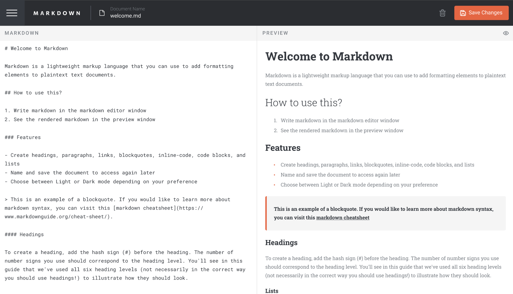
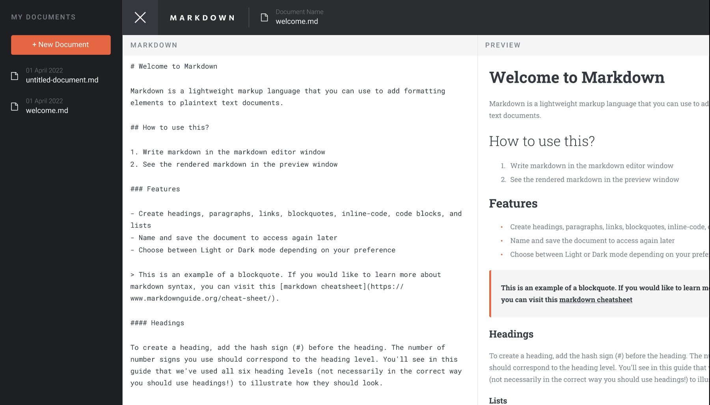
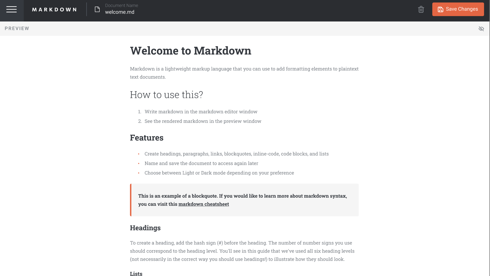

# Frontend Mentor - In-browser markdown editor solution

This is a solution to the [In-browser markdown editor challenge on Frontend Mentor](https://www.frontendmentor.io/challenges/inbrowser-markdown-editor-r16TrrQX9). Frontend Mentor challenges help you improve your coding skills by building realistic projects.

## Table of contents

- [Frontend Mentor - In-browser markdown editor solution](#frontend-mentor---in-browser-markdown-editor-solution)
  - [Table of contents](#table-of-contents)
  - [Overview](#overview)
    - [The challenge](#the-challenge)
    - [Screenshot](#screenshot)
    - [Links](#links)
  - [My process](#my-process)
    - [Built with](#built-with)
    - [What I learned](#what-i-learned)
    - [Useful resources](#useful-resources)

## Overview

### The challenge

Users should be able to:

- Create, Read, Update, and Delete markdown documents
- Name and save documents to be accessed as needed
- Edit the markdown of a document and see the formatted preview of the content
- View a full-page preview of the formatted content
- View the optimal layout for the app depending on their device's screen size
- See hover states for all interactive elements on the page
- **Bonus**: If you're building a purely front-end project, use localStorage to save the current state in the browser that persists when the browser is refreshed
- **Bonus**: Build this project as a full-stack application

### Screenshot

### Links

- Solution URL: [Add solution URL here](https://github.com/kasuSamuel/Amaliitech-NSP-Project-In-Browser-Markdown-Editor)
- Live Site URL: [Add live site URL here](https://amaliitech-nsp-project-in-browser-markdown-editor.vercel.app/)

## My process

- Set Up Angular Project: Install Angular CLI, create a new project.
- Install Packages: Install ngx-markdown for markdown support and marked for parsing.
- Configure ngx-markdown: Add MarkdownModule to your app module.
- Create Component: Generate a markdown editor component with a textarea and preview div.
- Style Component: Use CSS to style the editor and preview sections.
- Bind Data: Implement two-way data binding and preview updating in the component logic.
- Run Application: Serve the application to see the markdown editor in action.

### Built with

- Semantic HTML5 markup
- CSS custom properties
- Tailwind Css
- [Angular](https://angular.org/)

### What I learned

- Angular Basics: Setting up and configuring an Angular project, including creating and managing components.
- Third-Party Libraries: Installing, configuring, and using third-party libraries like ngx-markdown and marked to extend your       application's functionality.
- Data Binding: Implementing two-way data binding to synchronize user input and the live preview.
- HTTP Client: Using Angular's HttpClientModule for potential backend integration, such as saving and loading markdown files.
- Component Interaction: Structuring components and managing their interactions within the application.
- Styling: Applying styles using CSS and potentially integrating with Tailwind CSS or other styling frameworks.
- Markdown Parsing and Rendering: Understanding markdown syntax and how to parse and render it dynamically within an Angular      application.

### Useful resources

1. Official Documentation
   
 - Angular Documentation: Angular Official Docs
   Comprehensive guide to Angular's features and best practices.

  - ngx-markdown Documentation: ngx-markdown GitHub
    Detailed instructions on how to install, configure, and use ngx-markdown.

2. Tutorials and Guides
Angular Tutorials:
Angular Tutorial: Tour of Heroes: A step-by-step guide for learning Angular basics.
Building a Markdown Editor with Angular (third-party tutorial).

3. Third-Party Libraries
Marked Documentation: Marked Documentation
Guide to using the marked library for parsing markdown.
Tailwind CSS Documentation: Tailwind CSS Docs
Information on setting up and using Tailwind CSS for styling your application.

4. General Development
Stack Overflow: Angular Questions on Stack Overflow
Community-driven Q&A platform for troubleshooting and advice.
GitHub Repositories:
Angular Examples: Official Angular examples repository.
Awesome Angular: A curated list of awesome Angular resources and projects.